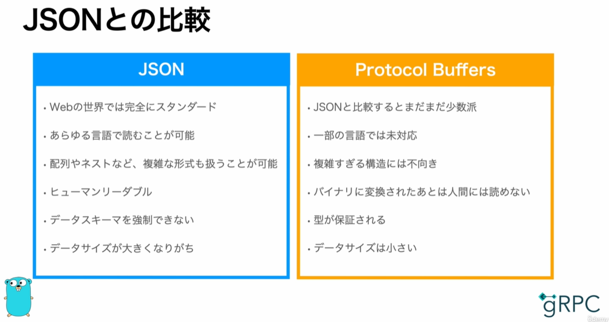
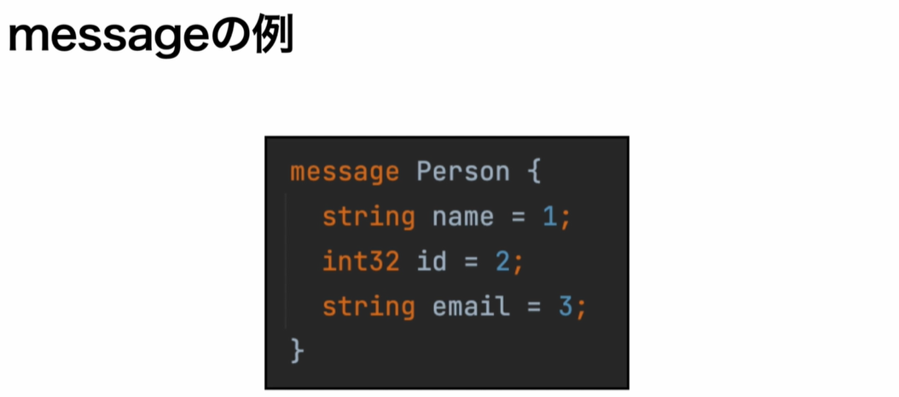
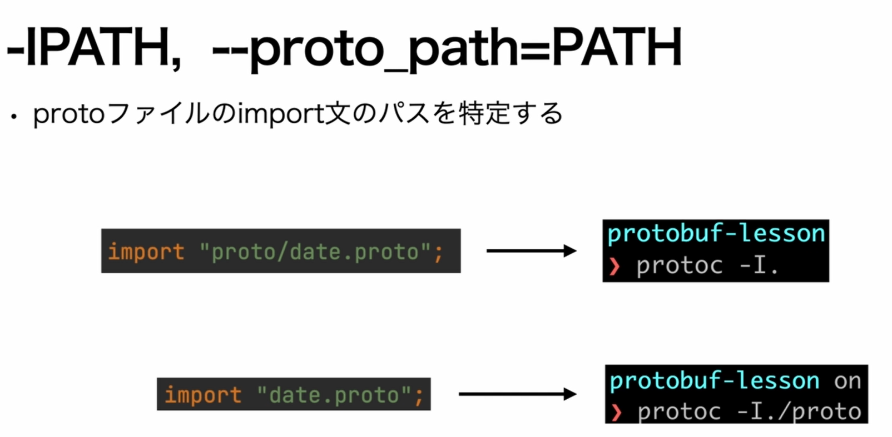
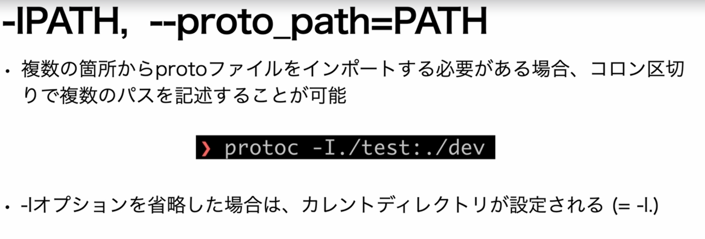
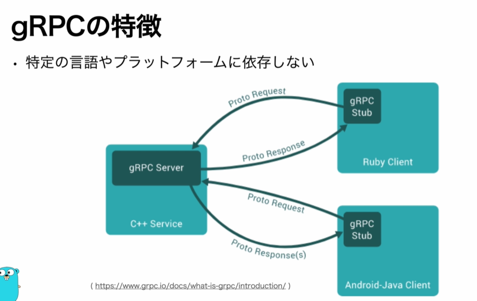
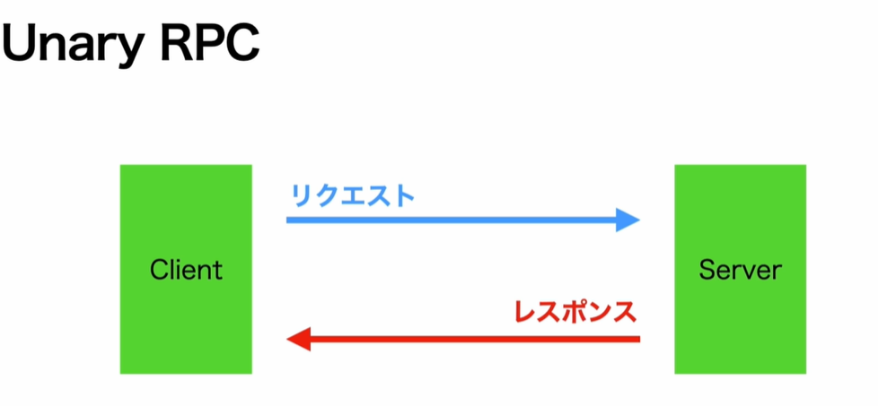
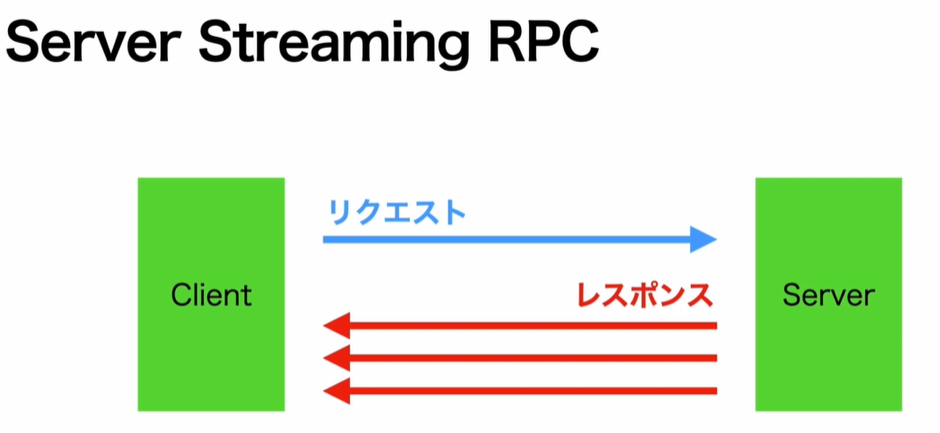
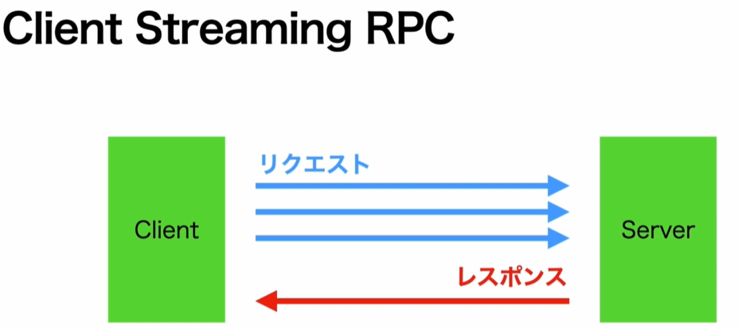
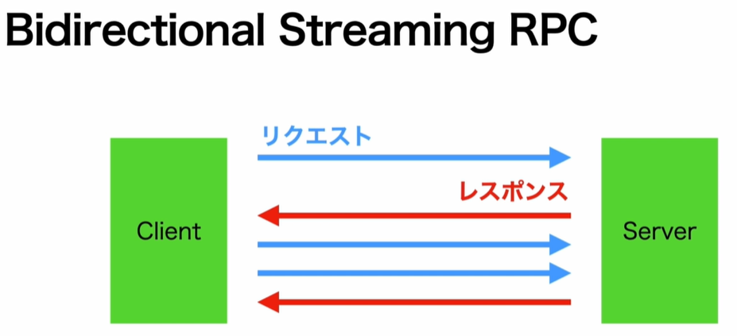

# Protocol Buffersとは
Googleによって2008年にオープンソース化されたスキーマ言語

【スキーマ言語】
何かしらの処理をさせるのではなく、要素や属性などの構造を定義するための言語

## スキーマ言語がなぜ重要か
マイクロサービス化が主流となっており、PCだけでなくIOSやAndroidのクライアント対応も必須となっている。
→ 事前にスキーマ言語で宣言的にI/Fを定義しておく

## Protocol Buffersの特徴
- gRPCのデータフォーマットとして使用されている

- プログラミング言語からは独立しており、様々な言語に変換可能
`Java, Go, Python, C++, Kotolin, etc...`


- バイナリ形式にシリアライズするので、サイズが小さく拘束な通信が可能

- 型安全にデータのやり取りが可能

- JSONに変換することも可能


## JSONとの比較



## Protocol Buffersを使用した開発の進め方
1. スキーマの定義
1. 開発言語のオブジェクトを自動生成
1. バイナリ形式へシリアライズ


# messageとは
- 複数のフィールドを持つことができる定義
- - それぞのフィールドはスカラ型もしくはコンポジット型
- 各言語のコードとしてコンパイルした場合、構造体やクラスとして変換される
- 1つのprotoファイルに複数のmessage型を定義することも可能


- メッセージ名;
- フィールド項目：型 - 名前 - タグ番号;

`※行末にはセミコロンが必要`

## スカラー型
[https://developers.google.com/protocol-buffers/docs/proto3#scalar](https://developers.google.com/protocol-buffers/docs/proto3#scalar)

## タグ
- Protocol Buffersではフィールドはフィールド名ではなく、タグ番号によって識別される
- タグ番号の重複は許されず、一意である必要がある
- タグの最小値は1, 最大値は2^29-1(値は536,870,911)
- 19000 ~ 19999はProtocol Buffersの予約番号のため使用不可

- 1~15番までは1byteで表すことができるため、よく使うフィールドは1~15番を割り当てる
(それを意識したメッセージにすることでパフォーマンス向上が望める)

- タグは連番にする必要はないので、あまり使わないフィールドはあえて16番以降を割り当てることも可能

- タグ番号を予約するなど、安全にProtocol Buffersを使用する方法も用意されている

## 列挙型
タグ番号は0から始まる、必ず0から始める必要がある
慣例的に0番はUNKNOWNにすることが多い

## デフォルト値
- 定義したmessageでデータをやり取りする際に、定義したフィールドがセット去れていない場合、そのフィールドのデフォルト値が設定される
- デフォルト値は型によって決められている

- - string: 空の文字列
- - bytes: 空のbyte
- - bool: false
- - 整数型・浮動小数点型: 0
- - 列挙型: タグ番号0の値
- - repeated: 空のリスト

## protocコマンド
- `-IPATH, --proto_path=PATH`



- `各言語に変換するためのオプション`
- - オプションによってどの言語に変換するかを決定する
- - `※Go言語のオプションはプラグインで追加する必要がある`
```
--cpp_out=OUT_DIR
--csharp_out=OUT_DIR
--java_out=OUT_DIR
--js_out=OUT_DIR
--kotlin_out=OUT_DIR
--objec_out=OUT_DIR
--php_out=OUT_DIR
--python_out=OUT_DIR
--ruby_out=OUT_DIR
--go_out=OUT_DIR ※プラグインが必要
```

- `コンパイルするファイルの指定`
```
protoc -I. --go_out=. proto/employee.proto proto/date.proto
```

```
protoc -I. --go_out=. proto/*.proto
```


# protoファイル生成コマンド(今回実行コマンド)
```
protoc -I. --go_out=. proto/*.proto

# pb/date.pb.goのimportエラーの為
go mod tidy
```

# gRPCとは
Googleによって2015年にオープンソース化されたRPC(Remote Procedure Call)の為のプロトコル

## RPC(Remote Procedure Call)とは
- Remote = 遠隔地(リモート)サーバーの
- Procedure = 手続き(メソッド)を
- Call = 呼び出す(実行する)
- ネットワーク上の他の端末と通信するための仕組み
- REST APIのようにパスやメソッドを指定する必要はなく、メソッド名と引数を指定する
- gRPC以外にJSON-RPCなどがあるが、今はgRPCがデファクトスタンダード

## gRPCの特徴
- データフォーマットはProtocol Buffersを使用
- - バイナリにシリアライズすることで送信データ量が減り、高速な通信を実現
- 型付けされたデータ転送が可能
- IDL(Protocol Buffers)からサーバー側・クライアント側に必要なソースコードを生成
- 通信にはHTTP/2を使用

- 特定の言語やプラットフォームに依存しない


## gRPCが適したケース
- Microservice間の通信
- - 複数の言語やプラットフォームで構成される可能性がある
- - バックエンド間であればgRPCの恩恵が多く得られる

- モバイルユーザーが利用するサービス
- - 通信料が削減できるため、通信容量制限にかかりにくい

- 速度が求められる場合

## gRPCの開発の流れ
1. protoファイルの作成
1. protoファイルをコンパイルしてサーバー・クライアントのひな形コードを作成
1. ひな形コードを使用してサーバー・クライアントを実装


# HTTP/2
## HTTP/1.1の課題
- リクエストの課題化
- - 1リクエストに対して1レスポンスという制約があり、大量のリソースで構成されるページを表示するには大きなネックになる
- プロトコルオーバーヘッド
- - Coockieやトークンなどを毎回リクエストヘッダに付与してリクエストするため、オーバーヘッドが大きくなる

## HTTP/2の特徴
- ストリームという概念を導入
- - 1つのTCP接続を用いて、複数のリクエスト/レスポンスのやり取りが可能
- - TCP接続を減らすことができるので、サーバーの負荷軽減

- ヘッダーの圧縮
- - ヘッダーをHPACKという圧縮方式で圧縮し、さらにキャッシュを行う事で、差分のみを送受信することで効率化

- サーバープッシュ
- - クライアントからのリクエストなしにサーバーからデータを送信できる
- - 事前に必要と思われるリソースを送信しておくことで、ラウンドトリップの回数を削減し、リソース読み込みまでの時間を短縮

### Demo
- http://www.http2demo.io

## Serviceとは
- RPC(メソッド)の実装単位
- - サービス内に定義するメソッドをエンドポイントになる
- - 1サービス内に複数のメソッドを定義できる
- サービス名、メソッド名、引数、戻り値を定義する必要がある
- コンパイルしてgoファイルに変換すると、インターフェースとなる
- - アプリケーション側でこのインターフェースを実装する

### Serviceのサンプル
```
message SayHelloRequest {}
message SayHelloResponse {}

service Greeter {
    rpc SayHello (SayHelloRequest) returns (SayHelloReponse);
}
```

## gRPCの通信方式
### 4種類の通信方式
- Unary RPC
- Server Streaming RPC
- Client Streaming RPC
- Bidirectional Streaming RPC

## Unary RPC
- 1リクエスト1レスポンスの方式
- 通常の関数コールのように扱うことが出来る
- 用途
- - APIなど



- `Service定義`
```
message SayHelloRequest {}
message SayHelloResponse {}

service Greeter {
    rpc SayHello (SayHelloRequest) returns (SayHelloReponse);
}
```


## Server Streaming RPC
- 1リクエスト・複数レスポンスの方式
- クライアントはサーバーから送信完了の信号が送信されるまでストリームのメッセージを読み続ける
- 用途
- - サーバーからのプッシュ通知など



- `Service定義`
```
message SayHelloRequest {}
message SayHelloResponse {}

service Greeter {
    rpc SayHello (SayHelloRequest) returns (stream SayHelloReponse);
}
```
※戻り値に`stream`が追加


## Client Streaming RPC
- 複数リクエスト・1レスポンスの方式
- サーバーはクライアントからリクエスト完了の信号が送信されるまでストリームからメッセージを読み続け、レスポンスを返さない
- 用途
- - 大きなファイルのアップロードなど



- `Service定義`
```
message SayHelloRequest {}
message SayHelloResponse {}

service Greeter {
    rpc SayHello (stream SayHelloRequest) returns (SayHelloReponse);
}
```
※引数に`stream`が追加

## Bidirectional Streaming RPC(双方向RPC)
- 複数リクエスト・複数レスポンスの方針
- クライアントとサーバーのストリームが独立しており、リクエストとレスポンスはどのような順序でもよい
- 用途
- - チャットやオンライン対戦ゲームなど


- `Service定義`
```
message SayHelloRequest {}
message SayHelloResponse {}

service Greeter {
    rpc SayHello (stream SayHelloRequest) returns (stream SayHelloReponse);
}
```
※戻り値と引数に`stream`が追加
